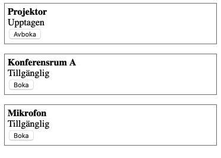
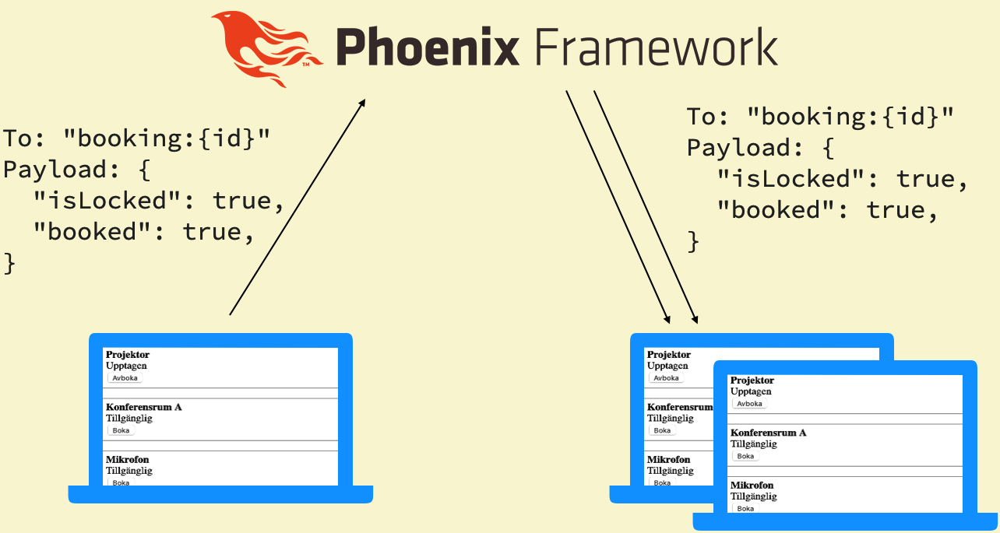

I ett [tidigare inlägg](https://codelabs.se/elixir-och-varfor-du-ska-anvanda-det) introducerade jag Elixir, vad det är och hur man kan använda det. Ett av de ställen där jag personligen sett stort värde i Elixir och dess styrkor är att använda det till att lägga till realtidsstöd i en befintlig webapp. Då antingen som ersättning för tidigare lösningar baserat på periodisk pollning av ett API eller lösningar med websockets från andra ramverk.

Det exempel vi ska utgå från är ett simpelt bokningssystem, där en användare kan boka en resurs genom att öppna den och göra en bokning som gäller från nu tills den manuellt avslutas. För att hålla exemplet så enkelt som möjligt finns det ingen användarhantering eller backend, utan allt hanteras i frontend med en statisk lista av resurser.

Systemet listar alla resurser


Bekräftelse när en användare bokar en resurs


I denna app så består bekräftelsen av en enkel fråga, det är däremot vanligt att kräva att användaren fyller i extra information om bokningen. I dessa fall tar ifyllningen längre tid och det blir viktigare att kunna visa att ifyllningen pågår.

Varför vill man då lägga till realtidsstöd? I detta exempel kanske det kan verka onödigt, men det är ofta så att användare förväntar sig att direkt se förändringar som andra användare gör. Det kan till exempel vara om bokningssystemet används för ett stort antal användare eller om det är någon annan typ av system där flera användare interagerar med varandra, till exempel om man vill kunna chatta med varandra inifrån systemet.

Skalet till systemet som används kan du hitta på [Github](https://github.com/mattiaslundberg/elixir-realtime/tree/3276afa1e12c4e3bab70e4ca4592a412d6d055ed/frontend), där finns också instruktioner för hur du kan visa appen lokalt om du vill följa med från din egen dator.

Det första vi behöver göra är att installera Elixir och Phoenix. Elixirs officiella instruktioner för installation hittar du [här](https://elixir-lang.org/install.html). Därefter installerar du Phoenix, eller i alla fall det verktyg som behövs för att skapa ett nytt projekt med Phoenix med `mix archive.install hex phx_new 1.5.6`. Nu är vi redo att skapa det Phoenix-projekt som vi kommer att bygga vidare på genom att köra kommandot
`mix phx.new realtime --no-ecto --no-html --no-webpack --no-gettext`
Detta skapar en grund till projektet, som inte innehåller någon databas, någon frontend eller några översättningar. I vårt exempel hanteras det redan av den befintliga applikationen.

Efter att genereringen är klar så har det skapats upp ett komplett skal till applikationen. De delar som är viktigast att känna till är

- `mix.exs` konfiguration för verktyget Mix, innehåller bland annat de beroenden som ska installeras och hur applikationen ska startas.
- `config` en mapp med konfiguration för hur applikationen ska köras baserat på miljö, bland annat hemligheter och var eventuell databas finns
- `tests` innehåller enhetstester för koden
- `lib/realtime/application.ex` beskriver de olika delar av systemet som ska startas (vilka processer som körs)
- `lib/realtime_web` innehåller all logik för hur klienter ska interagera med applikationen
- `router.ex` beskriver vilka endpoints som finns och vad de gör

- `channels` innehåller all websockethantering, och det är här vi kommer bygga vidare på applikationen

Nu kan vi starta applikationen genom att köra `mix phx.server` och gå in på http://localhost:4000/dashboard i webbläsaren. På denna sida visas olika mätvärden om systemet och det finns möjlighet att lägga till fler baserat på vad som är relevant för applikationen.

Det första vi ska göra är att skapa en ny kanal i Phoenix som vi ska använda för synkronisering av data. Detta gör vi genom att använda generatorn `mix phx.gen.channel Booking`. Phoenix kommer då skapa ett skal för den kanal som vi kommer använda. Det första vi behöver göra är att lägga till kanalen i `user_socket.ex` för att kanalen ska bli tillgänglig att använda. Det gör vi genom att lägga till raden `channel "booking:\*", RealtimeWeb.BookingChannel`.

I BookingChannel behöver vi lägga till två funktioner, den första är den funktion som hanterar nya anslutningar till kanalen. Den enklaste varianten på den funktionen ser ut såhär

```elixir
@impl true
def join("booking:" <> \_id, \_arguments, socket) do
{:ok, socket}
end
```

`@impl true` betyder att funktionen implementerar ett beteende från en beteendedefinition (Man kan jämföra det med ett interface i Java, även om det här handlar om funktioner eller grupper av funktioner istället för objekt).

Sedan följer funktionens definition, namnet på funktionen är join. Det första argumentet börjar med strängen `"booking:"` vilket kan verka lite underligt. Detta kommer från att Elixir använder sig av en teknik som kallas mönstermatchning (pattern matching) för att välja implementation av en funktion baserat på vilken data som skickas till funktionen. Därefter följer `<> \_id`, där `<>` är Elixirs synax för att sammanfoga strängar. Denna implementation av funktionen kommer matcha på strängar som börjar med `"booking:"` följt av ett id, till exempel `"booking:123"`. Mönstermatchning kan göra det enklare att organisera sin kod även om det kan vara svårt att greppa första gångerna.

Vi tar också in argument och en referens till anslutningen. Funktionen returnerar sedan tupeln `{:ok, socket}`, vilket betyder att anslutningen är redo att skicka och ta emot data. I denna funktion är det i normalfallet lämpligt att lägga logik för att verifiera att användaren har access till de resurser som ansluts mot, men det lämnas som en övning för läsaren. Att några av variablerna har ett `_` före sitt namn är ett sätt att tydligt visa att de inte används för andra utvecklare.

Den andra funktionen vi vill lägga till är ytterligare en definition av `handle_in`, denna läggs till tillsammans med de andra. Vilken som används bestäms av det första argumentet, med hjälp av mönstermatchning.

```elixir
@impl true
def handle_in("booking", payload, socket) do
broadcast_from(socket, "booking", payload)
{:noreply, socket}
end
```

Den tar in den datan som skickas och sedan med hjälp av funktionen `broadcast_from` skicka ut meddelandet till alla anslutna webbläsare förutom den som meddelandet kom från. Detta är det sista som behöver göras för att lägga till stödet i backend. Översiktligt så kommer kommunikationen se ut enligt följande:



För att lägga till användningen i den befintliga applikationen så behöver vi först installera Phoenix javascript bibliotek genom att köra `npm install --save phoenix`. Därefter kan vi lägga till en import och börja bygga logiken som behövs.

Detta görs i den befintliga Javascript applikationen genom att lägga till följande kod

```js
// Importera klassen som hanterar anslutningen
import {Socket} from "phoenix";

// Skapa en ny anslutning mot vår utvecklingsserver
let socket = new Socket("http://localhost:4005/socket", {});
socket.connect();
```

Nu är vi anslutna och kan lägga till stöd för att skicka och ta emot meddelanden. Det vi kommer att göra är att skicka två meddelanden, ett när användaren trycker på knappen (och har börjat fylla i uppgifter) och ett när bokningsstatusen ändras.

För varje resurs som går att boka lägger vi till denna kod för att hantera inkommande meddelanden

```js
// Skapa och anslut till kanalen
let channel = socket.channel(`booking:${resource.id}`, {});
channel.join();

// Lyssna på meddelanden
channel.on("booking", (m) => {
  // Kolla om knappen ska vara avaktiverad och uppdatera dess state
  if (m.isLocked) {
    bookButton.setAttribute("disabled", true);
  } else {
    bookButton.removeAttribute("disabled");
  }

  // Spara och visa rätt bokningsstatus för resursen
  if (m.hasOwnProperty("booked")) {
    updateBookingStatus(m.booked);
  }
});
```

För att skicka meddelanden så lägger vi till följande kod

```js
// Skicka låsning av knappen när någon trycker på den
channel.push("booking", {isLocked: true});

// Öppna bokningsdialog och vänta på ifyllning
const res = confirm(`Vill du ${bookedButtonDisplay(booked)}?`);
if (res) {
  // Skicka ny boknings och låssstatus till andra klienter och uppdatera denna
  channel.push("booking", {isLocked: !booked, booked: !booked});
  updateBookingStatus(!booked);
} else {
  // Lås upp bokning om den avbryts
  channel.push("booking", {isLocked: false});
}
```

När vi nu använder synkningen kan det se ut såhär när den ena användaren bokar en resurs

<iframe
  width="560"
  height="315"
  src="https://www.youtube.com/embed/KZ9Uw99yZ2g"
  frameborder="0"
  allow="accelerometer; autoplay; clipboard-write; encrypted-media; gyroscope; picture-in-picture"
  allowfullscreen
></iframe>

Nu har vi en fungerande synkronisering av händelser mellan klienter som sker helt utan fördröjning. Det vi inte har lagt till stöd för här är inladdning av dessa händelser för klienter som precis öppnar bokningssystemet. Detta kan göras genom att använda [Phoenix Presence](https://hexdocs.pm/phoenix/Phoenix.Presence.html) och lämnas som övning för läsaren.

När det kommer till produktionssättning så visar Elixir verkligen sin styrka. När man använder andra ramverk eller språk så behöver man ofta använda någon extern tjänst för att synkronisera meddelanden när man använder flera servrar, till exempel är Redis eller RabbitMQ vanliga att använda för detta. I Elixir kan man istället använda den funktionalitet för klustring som finns inbyggt i den virtuella maskinen. Med fördel kan man använda [libcluster](https://github.com/bitwalker/libcluster) för att enkelt hantera detta i olika miljöer, till exempel genom DNS eller Kubernetes metadata. Denna klustring gör det möjligt att att synkronisera data helt utan att lägga till ytterligare komponenter vilket gör systemet enklare att underhålla och skala utan betydande flaskhalsar. [Phoenix Blog](https://www.phoenixframework.org/blog/the-road-to-2-million-websocket-connections) beskriver hur det gått att skala upp till två miljoner samtidiga anslutningar med websockets på en ensam server, det är dessutom möjligt och enkelt att klustra flera av dessa servrar för att hantera ännu större mängder anslutningar.

All kod finns på [Github](https://github.com/mattiaslundberg/elixir-realtime).

_Inlägget är skrivet av Mattias Lundberg, senior systemutvecklare och arkitekt hos Code Labs._

Vill du arbeta med Elixir, eller vill ditt företag ha hjälp att bygga mjukvara med Elixir? Kontakta Code Labs [här](mailto:contact@codelabs.se)!
