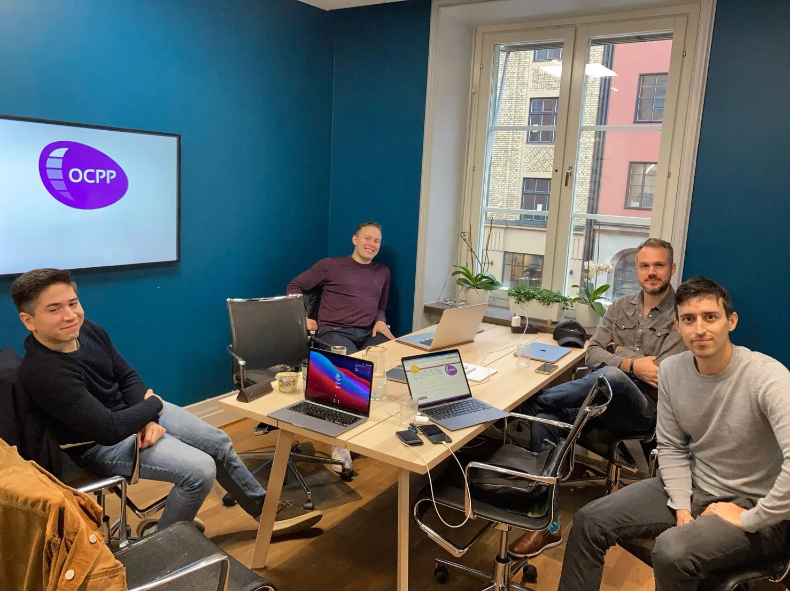
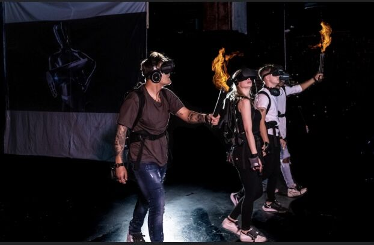
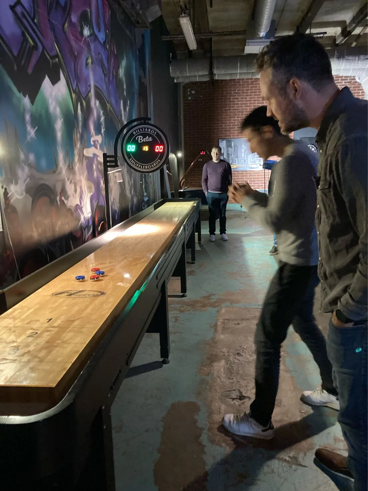
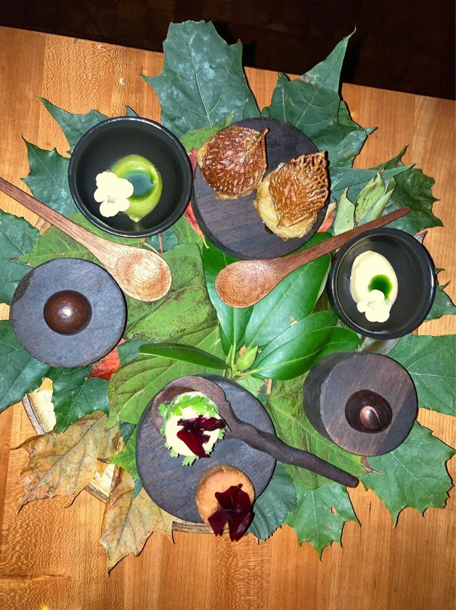

Det var dags för vår höst kick-off efter en lång tid av att arbeta hemifrån, vaccin som inte var tillgänglig för alla
samt restriktioner. Äntligen kunde vi ses och umgås fysiskt istället för våra digitala A.W som vi haft under pandemin.

Vi sågs på kontoret på KG10 där Tommy och Joatin gick igenom vårt interna projekt som de jobbat med sista tiden.

Projektet är hemligt just nu men är en produkt som vi hoppas ska hjälpa världen bli mer miljövänligare på ett enklare sätt.

Efter detta gick vi och åt lunch och tog sedan taxi ut till Bromma för att köra Virtual Reality och spela Shuffleboard på VR Center.

Virtual Reality va extremt roligt! Hårdvaran var Oculus Rift headsets som var kopplat till en HP dator man bar som en ryggsäck.

Man gick runt i en stor lokal där alla var i samma VR värld tillsammans och gjorde utmaningar ihop.

Flera av oss har även Oculus Quest headsets som vi använder för utveckling och det var kul att uppleva
andra tillverkares lösningar.

Vi passade även på att spela lite shuffle board medan vi väntade där vi delade upp oss i två team.

Sen var det dags att ta sig ut till resturang Ekstedt för en 7 rätters middag med tillhörande vinpaket.

Det blev en bra kväll med mycket skratt, teknik snack och god mat!

